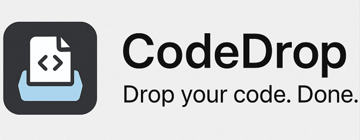

# 🚀 CodeDrop – Push Code to GitHub from Any Website

**CodeDrop** is a personal browser extension that helps you push your **C++ code submissions** directly to your GitHub repository — from **GeeksforGeeks**, **LeetCode**, or *any coding platform* — with custom commit messages, difficulty level, and approach notes.

<p align="center">
  
</p>

---

## 🧠 What It Does

- Push your code submissions to GitHub via a simple popup UI.
- Automatically captures the active tab’s URL (no scraping needed).
- Add metadata: question name, difficulty, commit message, and your approach.
- Generates `.cpp` files with a clean, structured header.
- Works on both **Chrome** and **Firefox**.

---

## ⚙️ Supported Browsers

CodeDrop comes with **two separate manifest files**:

- `manifest.chrome.json` → for **Google Chrome**
- `manifest.firefox.json` → for **Mozilla Firefox**

**Before using the extension**:

- ✅ For **Chrome**: Rename `manifest.chrome.json` to `manifest.json`
- ✅ For **Firefox**: Rename `manifest.firefox.json` to `manifest.json`

---

## 🛠️ Setup Instructions

### 1. 📦 Clone the Repository

```bash
git clone https://github.com/Ashhar-24/CodeDrop_Extension.git
cd CodeDrop_Extension
```

### 2. ✏️ Update GitHub Configuration

Navigate to `/src/background.js` and update the following constants with your own details:

```js
const GITHUB_USERNAME = "your-username";
const GITHUB_REPO = "your-repo-name";
const GITHUB_TOKEN = "your-personal-access-token";

```

---


### 🧾 How to Generate a GitHub Token:

1. Go to: https://github.com/settings/tokens

2. Click "Generate new token (classic)"

3. Give it a name and select scopes:
        -  `repo` (Full control of private repositories)

4. Copy the generated token and paste it in the background file.

---- 


# 🧪 Test & Run

## 🟢 For Chrome

1. Open `chrome://extensions`

2. Enable Developer Mode

3. Click "Load unpacked"

4.  Select the root directory where `manifest.json` is located (after renaming `manifest.chrome.json` to `manifest.json`)

5. The extension should appear in the toolbar

## 🔵 For Firefox

1. Open Firefox and go to `about:debugging`

2. Click "This Firefox"

3. Click "Load Temporary Add-on"

4. Choose any file inside your root folder (e.g., `manifest.json`, after renaming `manifest.firefox.json` to `manifest.json)

5. The extension will be temporarily loaded

⚠️ Note: Firefox does not yet support `manifest_version: 3` fully. Use `manifest_version: 2` in `manifest.firefox.json`.

---

# 🤝 Contributing

Pull requests are welcome! For major changes, please open an issue first.

---

# 🌐 Author

**Md Ashhar**  
[🔗 LinkedIn](https://www.linkedin.com/in/md-ashhar/) • [💻 GitHub](https://github.com/Ashhar-24) • [🌐 Portfolio](https://parichay-2-0.vercel.app)
